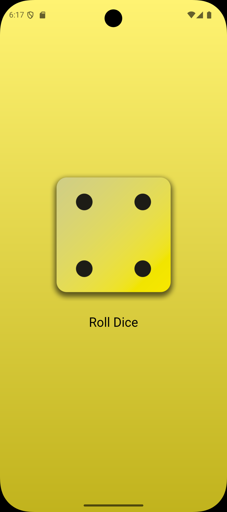

# Dice Roller

A Flutter app that generates random dice rolls with an animated, gradient-themed user interface.

## Project Description

Dice Roller is a simple yet elegant Flutter application that simulates rolling a dice. The app features a beautiful gradient background, custom Google Fonts typography, and an interactive button to generate random dice values. It's a great beginner project for learning Flutter basics including state management, widgets, and styling.

## Features

- 🎲 **Random Dice Roll Generator** - Tap a button to generate a random number between 1-6
- 🎨 **Beautiful Gradient UI** - Gradient background that transitions from teal to blue
- 🔤 **Custom Typography** - Uses Google Fonts (Lato) for enhanced text styling
- ⚡ **Lightweight & Fast** - Minimal dependencies and optimized performance
- 📱 **Cross-platform Support** - Works on iOS, Android, Web, Linux, macOS, and Windows

## Screenshots

Here are some screenshots of the app:




## Installation & Setup

### Prerequisites

- Flutter SDK installed ([Install Flutter](https://flutter.dev/docs/get-started/install))
- Dart SDK (comes with Flutter)
- A code editor (VS Code, Android Studio, or IntelliJ)

### Steps

1. **Clone the repository:**

   ```bash
   git clone https://github.com/Advaith-dev/dice.git
   cd dice
   ```

2. **Install dependencies:**

   ```bash
   flutter pub get
   ```

3. **Run the app:**

   ```bash
   flutter run
   ```

## Dependencies

- `flutter` - UI framework
- `google_fonts: ^6.3.2` - Custom font library
- `cupertino_icons: ^1.0.8` - iOS-style icons

## Project Structure

```dart
lib/
├── main.dart              # App entry point
├── dice_roller.dart       # Dice roller widget
└── gradient_container.dart # Gradient background widget
```

## How It Works

The app uses Flutter's `StatefulWidget` to manage the current dice value. Each time you tap the button, it generates a random number and updates the UI with an animation.

## Resources

- [Flutter Documentation](https://flutter.dev/)
- [Dart Language Guide](https://dart.dev/guides)

## License

This project is open source and available under the MIT License.
